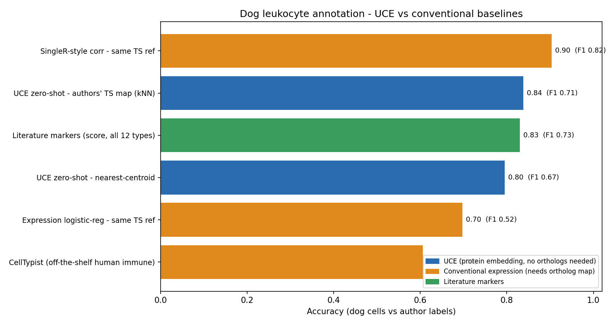
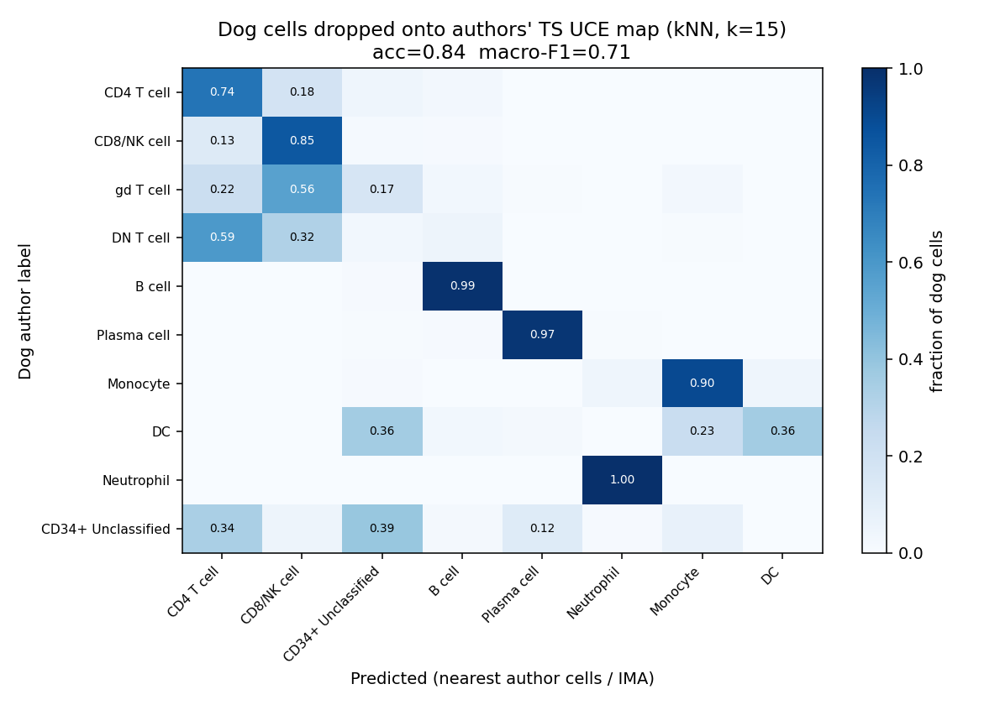
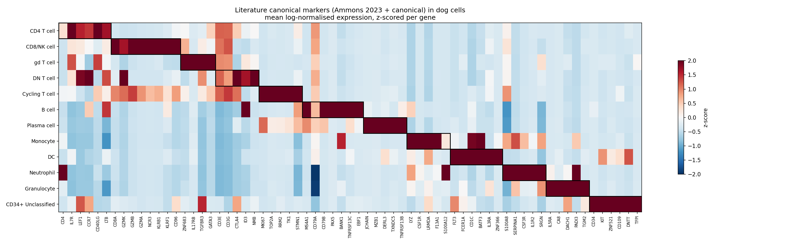
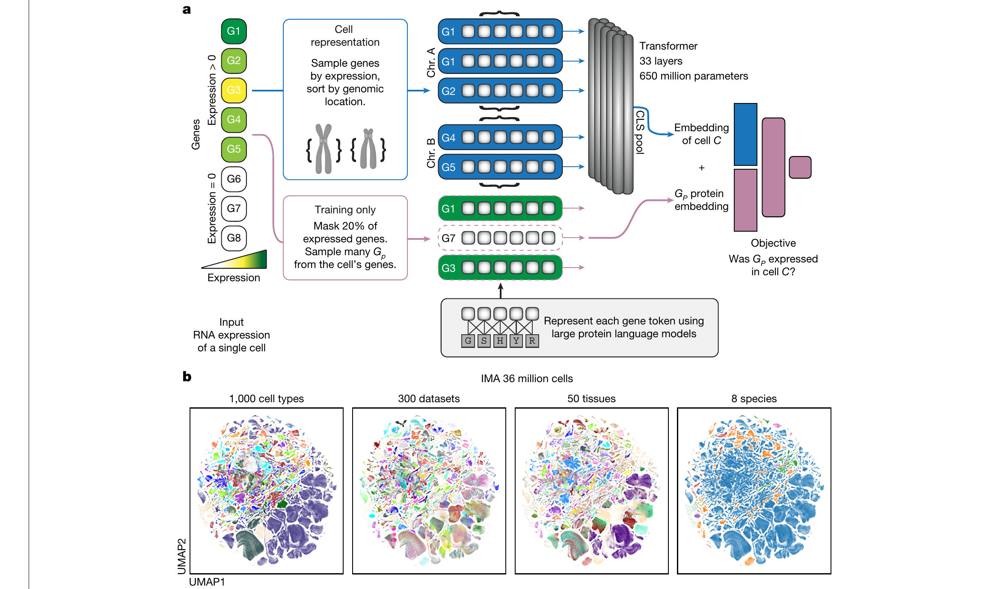

# UCE Canine Recap — zero-shot cell-type annotation of a new species

Reproducing the **Universal Cell Embeddings (UCE)** "add a new species" use case on a **canine** immune
atlas, then benchmarking it honestly against conventional annotation tools.

## TL;DR

- Added **canine** to UCE as a brand-new species from its proteome alone — **no cell-type labels, no gene-symbol matching** — and embedded 93,011 canine immune cells.
- Annotated them zero-shot by dropping them onto the **authors' own Tabula Sapiens UCE map**: **0.84 accuracy** across immune lineages (neutrophil recall **1.00**).
- Benchmarked against conventional tools. The honest result: **UCE is competitive, not dominant** — a SingleR-style correlation on the same reference reaches **0.90**. UCE's real edge is **representational** (no ortholog mapping, works reference-free, one model per all species).

---

## The workflow (what we did)

<p align="center">
  
</p>

<sub>Original illustration made for this project. A precise, text-exact diagram of the same pipeline is in <a href="figures/workflow_schematic.png"><code>figures/workflow_schematic.png</code></a>.</sub>

| # | Step | Why | How |
|---|------|-----|-----|
| 1 | Canine proteome | UCE keys genes by protein | Parse Ensembl CanFam3.1 peptides, longest per gene (20,257) — `scripts/01_parse_proteome.py` |
| 2 | ESM-2 15B embeddings | UCE needs 5120-d ESM-2 embeddings | `esm2_t48_15B_UR50D` on GPU, mean-pool — `scripts/embed_esm2.py` |
| 3 | Add canine as a species | UCE needs per-species token/chrom/offset files | `scripts/build_newspecies.py` |
| 4 | Canine scRNA h5ad | UCE input = raw counts keyed to genes | GEO raw → ENSCAFG-keyed AnnData — `scripts/build_dog_h5ad_enscafg.py` |
| 5 | UCE inference | Produce cell embeddings | UCE 33-layer on GPU → 93,011×1280 — `scripts/deploy_uce.py`, `extract_uce.py` |
| 6 | Labelled reference | Model outputs an embedding, not a label | Authors' own TS UCE map + cell-ID label join — `scripts/fetch_member1.py`, `eval_ima.py` |
| 7 | Evaluate | Separate "good embedding?" from "transfer works?" | Intrinsic / authors'-map / baselines |
| 8 | Healthy vs OS | Do predicted shifts track disease? | Proportions by condition |

## Results

| Method | Accuracy | macro-F1 | Family |
|---|---|---|---|
| SingleR-style correlation — same TS reference | **0.904** | 0.817 | conventional |
| **UCE zero-shot — authors' TS map (kNN)** | **0.838** | 0.708 | UCE |
| Literature markers (all 12 types) | 0.830 | 0.726 | marker |
| UCE zero-shot — nearest-centroid | 0.795 | 0.673 | UCE |
| Expression logistic-regression — same TS ref | 0.697 | 0.518 | conventional |
| CellTypist (off-the-shelf human immune) | 0.606 | 0.392 | conventional |

<p align="center">
  
</p>

Read the numbers as: with a good reference *and* ortholog mapping, a plain correlation method beats UCE
here. UCE's value is that it needs **no ortholog/gene-symbol mapping** (it embeds proteins, so canine genes
with no human symbol still contribute), it works **reference-free** (intrinsic kNN label purity **0.88**),
and it's **one model across all species**. CellTypist is weakest (0.61) because its PBMC-trained model has no
neutrophils and loses genes to cross-species symbol mismatch.

<p align="center">
  
  
</p>

More figures in [`figures/`](figures/); metrics/tables in [`results/`](results/).

## The model (what UCE does)

UCE represents each **gene by the ESM-2 embedding of its protein**, feeds the expressed genes of a cell
(sampled by expression, ordered by chromosome, plus a `[CLS]` token) through a **33-layer, 650M-parameter
transformer** trained self-supervised, and reads out a **1280-d cell embedding** from `[CLS]`.

Because genes are keyed by protein rather than by symbol, **a new species only needs its proteome** — which
is exactly what makes the canine experiment possible.

<p align="center">
  
</p>

<sub>Figure 1 from Rosen, Y. et al. <em>Universal cell embedding provides a foundation model for cell biology</em>, <strong>Nature</strong> (2026), <a href="https://doi.org/10.1038/s41586-026-10689-z">doi:10.1038/s41586-026-10689-z</a>. © The authors, licensed under <a href="http://creativecommons.org/licenses/by-nc-nd/4.0/">CC BY-NC-ND 4.0</a> — reproduced unmodified. This figure is <strong>not</strong> covered by this repository's MIT license (see <a href="ATTRIBUTION.md">ATTRIBUTION.md</a>). A simplified redraw is in <code>figures/model_schematic.png</code>. Repo: <a href="https://github.com/snap-stanford/UCE">snap-stanford/UCE</a>.</sub>

## Reproduce

```bash
pip install -r requirements.txt
# 1. proteome -> longest protein per gene
python scripts/01_parse_proteome.py --fasta <Ensembl_CanFam3.1_pep.fa.gz> --outdir .
# 2. ESM-2 15B protein embeddings (GPU; or download ours, see data/DATA.md)
python scripts/embed_esm2.py --fasta dog_longest.pep.fa --out dog_esm2_embeddings.pt
# 3. add canine as a new UCE species
python scripts/build_newspecies.py --pe dog_esm2_embeddings.pt --gene-table dog_gene_table.csv --outdir model_files
# 4-5. build canine h5ad + run UCE  (see scripts/deploy_uce.py for the GPU pipeline)
# 6-8. evaluation + baselines
python scripts/eval_ima.py            # authors'-map zero-shot annotation
python scripts/celltypist_baseline.py # CellTypist baseline
python scripts/expr_baseline.py       # SingleR-style + expression baselines
python scripts/canonical_markers.py   # literature-marker panel + heatmap
python scripts/build_benchmark.py     # comparison figure
```

The **canine ESM-2 protein embeddings we generated** (20,257 genes × 5120-d, ~201 MB) are released separately —
see [`data/DATA.md`](data/DATA.md). All other artifacts are regenerable from the sources in
[`RESOURCES.md`](RESOURCES.md).

## Resources & data

See [`RESOURCES.md`](RESOURCES.md) for every dataset, model, and tool with links (GEO GSE225599, Ensembl,
ESM-2, UCE, Zenodo, CZ CELLxGENE, CellTypist, RunPod) and the Ammons et al. 2023 source paper.

## Acknowledgements & citations

- UCE — Rosen et al., *Universal cell embedding provides a foundation model for cell biology*, Nature (2026). https://doi.org/10.1038/s41586-026-10689-z · https://github.com/snap-stanford/UCE
- Canine atlas — Ammons et al. 2023, *A single-cell RNA sequencing atlas of circulating leukocytes from healthy and osteosarcoma affected dogs*, Front. Immunol. https://doi.org/10.3389/fimmu.2023.1162700
- ESM-2 — Lin et al., *Evolutionary-scale prediction of atomic-level protein structure with a language model*.

## License

Code in this repo: MIT (see [LICENSE](LICENSE)). Underlying datasets/models retain their own licenses.

*This is an independent educational reproduction and benchmark, not affiliated with the original authors.*
